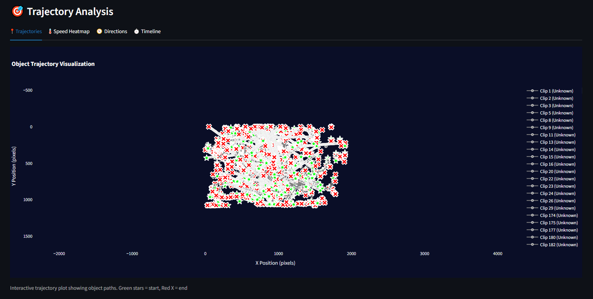

<div align="center">

# 🌌 SkySeer: Autonomous Night Sky Surveillance
### AI-Powered Detection for Satellites, Meteors, and UAP

[](https://python.org)
[](https://opencv.org/)
[](https://streamlit.io/)

<br>

<br>

<p align="center">
  <b>SkySeer</b> uses Computer Vision to turn hours of raw night-sky footage into actionable data.<br>
  It autonomously isolates movement, calculates flight kinematics, and classifies objects without human supervision.
</p>

</div>

---

## 🚀 The Engineering Pipeline
We process raw video through a 3-stage pipeline.

| **System Architecture** | **The Problem** |
|:---:|:---|
|  | Amateur astronomers record terabytes of footage, but 99% of it is empty sky.<br><br><b>SkySeer</b> filters out the static stars and only captures independent movement, reducing 10 hours of video to a 2-minute "Highlights" reel of Satellites and Meteors. |

---

## 🛠️ Step-by-Step Logic
Here is exactly how the Computer Vision engine works, step-by-step.

| **Step 1: Motion Isolation** | **Step 2: Feature Extraction** |
|:---:|:---:|
|  |  |
| We use **Mixture of Gaussians (MOG2)** to subtract the static background stars. | For every moving object, we calculate a **Velocity Vector** $(\Delta x, \Delta y)$ and **Linearity Score** ($R^2$). |

| **Step 3: ML Classification** | **Step 4: Output Generation** |
|:---:|:---:|
|  |  |
| **K-Means Clustering** groups objects by behavior (Speed vs. Duration) to label them. | The system generates a CSV manifest and a 10x speed timelapse. |

---

## 🎛️ Configuration & Tuning
SkySeer allows for granular control over the detection thresholds to handle different weather conditions.

| **Upload & Status** | **Sensitivity Tuning** |
|:---:|:---:|
|  |  |
| *Real-time processing logs.* | *Adjusting the pixel threshold.* |

| **Frame Skipping** | **Advanced Filters** |
|:---:|:---:|
|  |  |
| *Optimizing for 4K footage.* | *Filtering wind/cloud noise.* |

---

## 📸 Detection Results

The system autonomously classifies objects based on their flight behavior.

| **🔴 Satellite Detection (Class 0)** | **🟡 Meteor Detection (Class 1)** |
|:---:|:---:|
|  |  |
| **Characteristics:**<br>• High Linearity ($R^2 > 0.95$)<br>• Constant Velocity<br>• Long Duration | **Characteristics:**<br>• High Velocity Spike<br>• Transient Duration<br>• Brightness Flare |

---

## 💻 Installation & Usage

### 1. Clone the Repo
```bash
git clone [https://github.com/IkerSimarro/SkySeer.git](https://github.com/IkerSimarro/SkySeer.git)
cd SkySeer

📂 Project Structure
SkySeer/
├── src/
│   ├── motion_engine.py    # Core MOG2 Logic
│   ├── kinematics.py       # Velocity & Linearity Math
│   ├── classifier.py       # Scikit-Learn K-Means Logic
│   └── app.py              # Streamlit Entry Point
├── Screenshots/            # Documentation Images
├── requirements.txt        # Dependencies
└── README.md               # Documentation

👨‍💻 Author
Iker Simarro Cuevas

Focus: Computer Vision, Signal Processing, Scientific ML

https://www.linkedin.com/in/iker-simarro-546169227/
