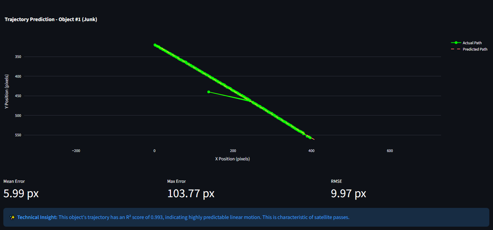
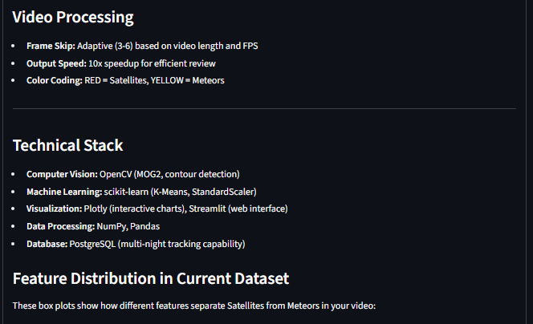
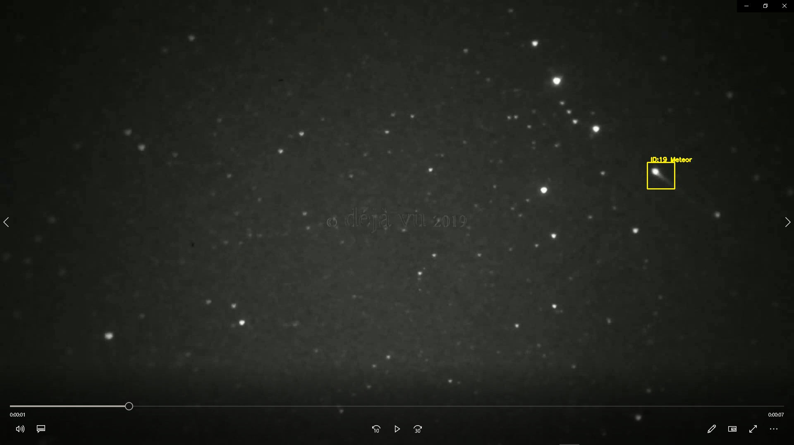
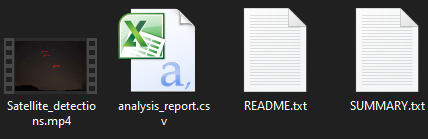

<div align="center">

# 🌌 SkySeer: Autonomous Night Sky Processing
### AI-Powered Detection for Satellites, Meteors, and UAP

[](https://python.org)
[](https://opencv.org/)
[](https://scikit-learn.org/)
[](https://streamlit.io/)

<br>

<br>

<p align="center">
  <b>SkySeer</b> uses Computer Vision to turn hours of raw night-sky footage into actionable data.<br>
  It autonomously isolates movement, calculates flight kinematics, and classifies objects without human supervision.
</p>

</div>

---

## 🔬 Technical Architecture
SkySeer operates on a custom **3-Stage Pipeline** that transforms raw pixels into classified astronomical events.

### 1. Motion Isolation (Computer Vision)
We accept raw video (4K/1080p) and process it using **Mixture of Gaussians (MOG2)** background subtraction.
* **Algorithm:** `cv2.createBackgroundSubtractorMOG2`
* **Parameters:** Adaptive variance threshold (45), History (500 frames).
* **Noise Reduction:** Morphological Opening/Closing to remove sensor grain.

<div align="center">
  
  <p><i>The pipeline filters 99% of empty sky frames, passing only active contours to the next stage.</i></p>
</div>

### 2. Kinematic Feature Extraction
Every tracked object is transformed into an **11-Dimensional Feature Vector**. We don't just look at the image; we look at the *physics* of the flight path.

| **Core Features** | **Visualized Data** |
|:---|:---:|
| • **Velocity:** Avg speed ($px/frame$) and Acceleration.<br>• **Linearity ($R^2$):** How straight the trajectory is.<br>• **Consistency:** Standard deviation of speed.<br>• **Blinking Score:** Detects periodic flashing (planes).<br>• **Duration:** Total time on screen. | <br><i>Linear Regression analysis calculating the RMSE of a satellite trajectory ($R^2 \approx 0.99$).</i> |

### 3. Unsupervised Classification (Machine Learning)
Instead of relying on labeled datasets (which are scarce for night sky objects), SkySeer uses **K-Means Clustering** to separate objects based on their kinematic signatures.

* **Scaling:** All 11 features are normalized using `StandardScaler`.
* **Clustering:** Objects group naturally into two distinct classes:
    * **Satellites:** High Linearity, Low Speed Variance, Long Duration.
    * **Meteors:** High Velocity, High Burst Brightness, Short Duration.

<div align="center">
  
  <p><i>Feature Distribution Analysis: Notice the clear separation in "Duration" and "Speed" between Satellites (Dark Blue) and Noise (Light Blue).</i></p>
</div>

---

## 📸 Detection Results

The system outputs a processed video with color-coded bounding boxes and valid confidence scores.

| **🔴 Satellite Detection** | **🟡 Meteor Detection** |
|:---:|:---:|
|  |  |
| **Class 0 Characteristics:**<br>• High Linearity ($R^2 > 0.95$)<br>• Constant Velocity<br>• Long Duration (>3s) | **Class 1 Characteristics:**<br>• High Velocity Spike<br>• Transient Duration (<2s)<br>• Brightness Flare |

---

## 📊 Data Visualization
SkySeer provides an interactive dashboard to analyze the night's traffic.

| **Speed Heatmaps** | **Classification Breakdown** |
|:---:|:---:|
|  |  |
| *Visualizing traffic lanes and velocity hotspots.* | *Quantifying the ratio of Satellites vs. Junk/Noise.* |

---

## ⚙️ Configuration & Output

| **Fine-Tuning Controls** | **Data Export** |
|:---|:---|
|  | <br><br><b>The Output Package:</b><br>SkySeer generates a comprehensive mission folder containing:<br>• `Satellite_detections.mp4` (10x Speed)<br>• `analysis_report.csv` (Scientific Data)<br>• `SUMMARY.txt` (Quick Stats) |

---

📂 Project Structure
SkySeer/
├── src/
│   ├── motion_engine.py    # Core MOG2 Logic
│   ├── kinematics.py       # Velocity & Linearity Math
│   ├── classifier.py       # Scikit-Learn K-Means Logic
│   └── app.py              # Streamlit Entry Point
├── Screenshots/            # Documentation Images
├── requirements.txt        # Dependencies
└── README.md               # Documentation

👨‍💻 Author
Iker Simarro Cuevas

Focus: Computer Vision, Signal Processing, Scientific ML

https://www.linkedin.com/in/iker-simarro-546169227/

---

## 💻 Installation & Usage

### 1. Clone the Repo
```bash
git clone [https://github.com/IkerSimarro/SkySeer.git](https://github.com/IkerSimarro/SkySeer.git)
cd SkySeer

