<div align="center">

# 🌌 SkySeer: Autonomous Night Sky Surveillance
### AI-Powered Detection for Satellites, Meteors, and UAP

[](https://python.org)
[](https://opencv.org/)
[](https://streamlit.io/)

<br>
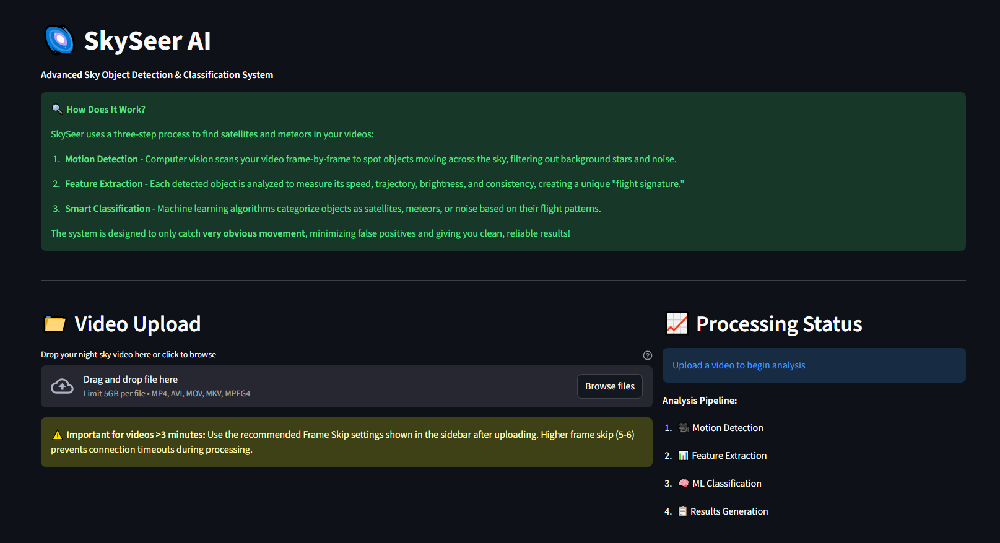
<br>

<p align="center">
  <b>SkySeer</b> is a computer vision engine that turns raw night-sky footage into actionable data.<br>
  It autonomously filters static stars, isolates moving objects, and classifies them into <b>Satellites</b>, <b>Meteors</b>, or <b>Noise</b> using unsupervised learning.
</p>

</div>

---

## 🚀 1. The Engineering Problem
Amateur astronomers record terabytes of footage, but 99% of it is empty sky. Manual analysis is tedious, and standard motion detectors fail because they cannot distinguish between specific celestial objects.

**SkySeer** solves this with a custom 3-stage pipeline.

<div align="center">
  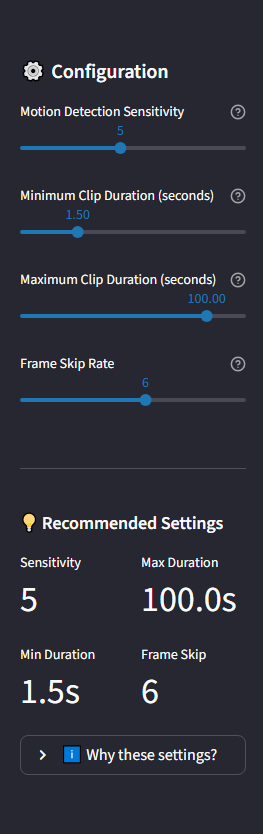
  <p><i>The automated processing pipeline: Motion -> Features -> Classification.</i></p>
</div>

---

## ⚙️ 2. System Configuration & Upload
The application provides a drag-and-drop interface for processing video files (MP4, AVI, MKV).

| **Upload Interface** | **Processing Status** |
|:---:|:---:|
|  | 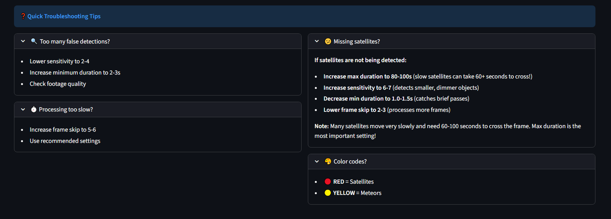 |
| *Simple drag-and-drop entry point.* | *Real-time feedback on the analysis pipeline.* |

---

## 🛠️ 3. The Engineering Pipeline (Deep Dive)

### Step 1: Motion Isolation (Background Modeling)
We use **MOG2 (Mixture of Gaussians)** to model the static star field. This allows the system to "subtract" the sky and only focus on independent movement.
* **Sensitivity:** Controls the threshold for pixel variance.
* **Frame Skip:** Accelerates processing for 4K/long-exposure footage.

<div align="center">
  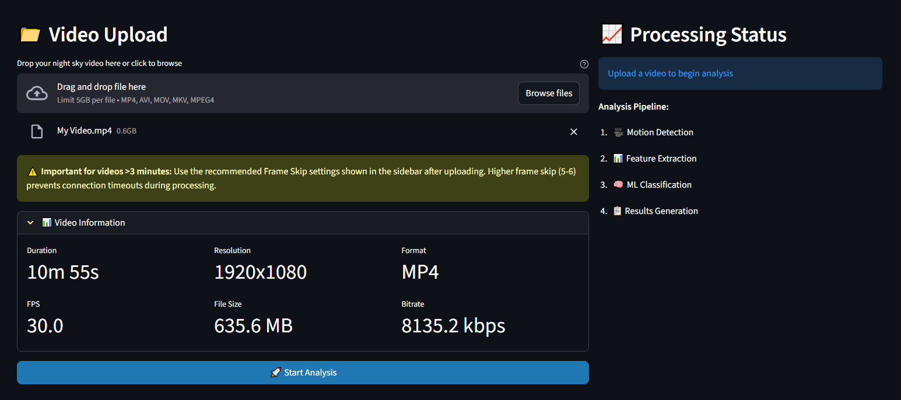
  <p><i>Configuring the Motion Detection Engine.</i></p>
</div>

### Step 2: Feature Extraction (Kinematics)
Once an object is tracked, we extract its **Flight Signature**.
* **Velocity Vector:** Speed ($\Delta x, \Delta y$) per frame.
* **Linearity ($R^2$):** How straight the path is (Satellites $\approx$ 1.0).
* **Duration:** How long the object persists.

<div align="center">
  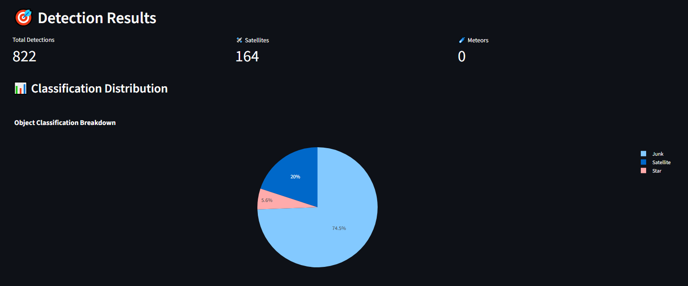
  <p><i>Extracting kinematic features from raw contours.</i></p>
</div>

### Step 3: Unsupervised Classification
Instead of labeled training data, we use **K-Means Clustering** to group objects based on their kinematic features.
* **Satellites:** High linearity, constant speed.
* **Meteors:** High speed, short duration, brightness flares.

<div align="center">
  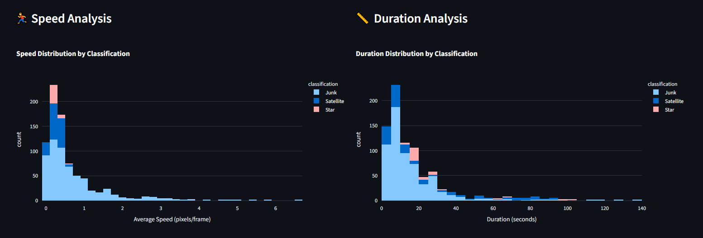
  <p><i>The Machine Learning classification logic.</i></p>
</div>

---

## 🎛️ 4. Fine-Tuning & Optimization
Night sky footage varies wildly (light pollution, clouds, sensor noise). SkySeer allows for granular control over the computer vision thresholds to reduce false positives.

| **Detection Settings** | **Advanced Filters** |
|:---:|:---:|
| 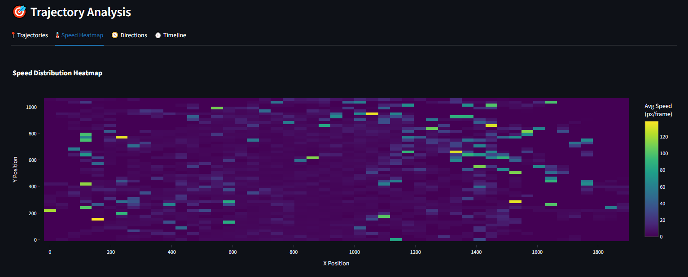 | 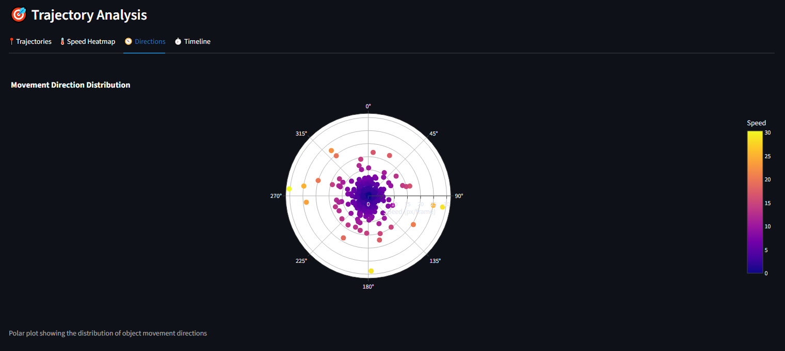 |
| *Adjusting minimum object area and duration.* | *Filtering out wind shake and cloud noise.* |

---

## 📸 5. Detection Results

The system outputs a processed video with color-coded bounding boxes and a detailed CSV manifest.

### 🔴 Satellite Detection (Class 0)
Identified by **Linear Trajectory** and **Sustained Velocity**. Note the red bounding box and the ID tag.

<div align="center">
  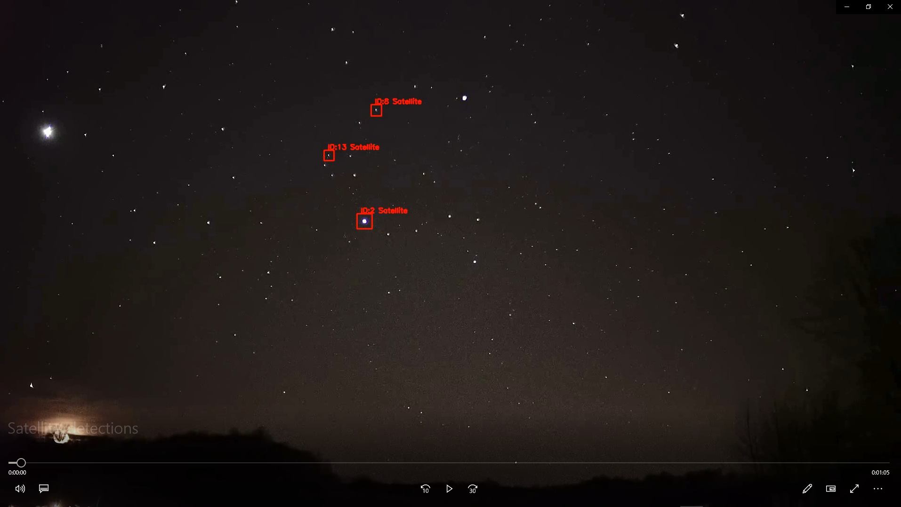
</div>

### 🟡 Meteor Detection (Class 1)
Identified by **High Velocity** and **Transient Duration**. Note the yellow bounding box distinguishing it from the satellite.

<div align="center">
  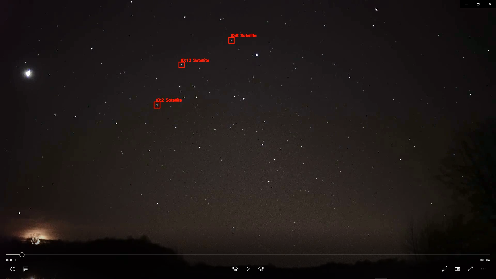
</div>

### 📊 Data Export
SkySeer generates a folder containing the sped-up video (10x) and a CSV report for scientific analysis.

<div align="center">
  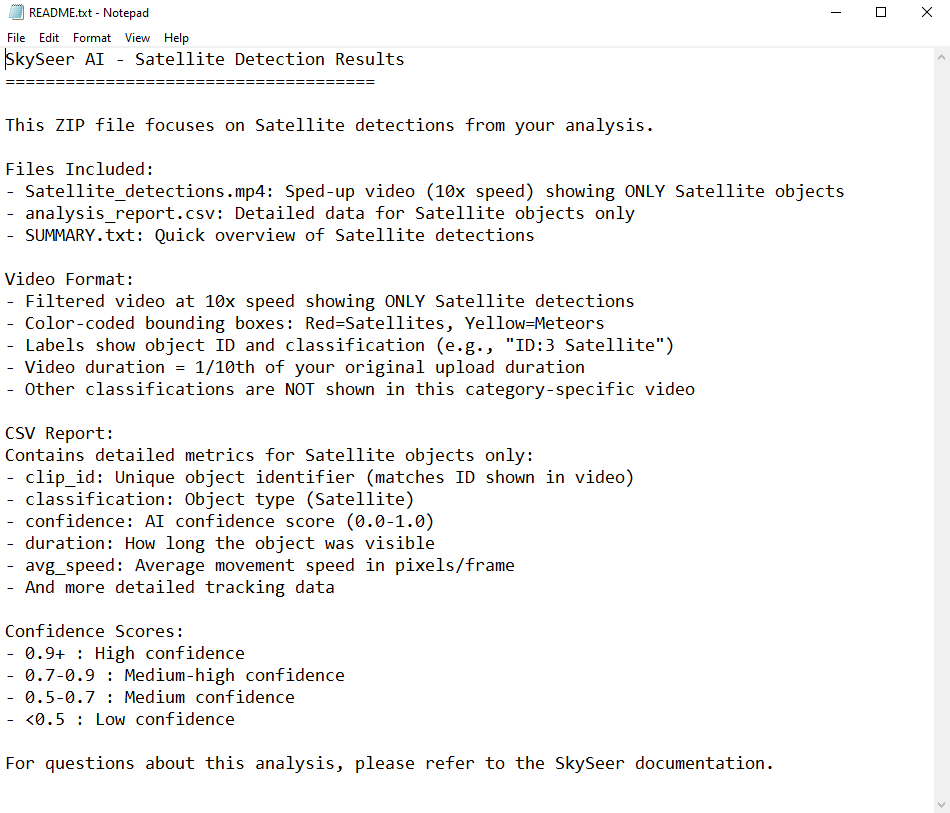
  <p><i>The final output manifest containing object IDs, timestamps, and classifications.</i></p>
</div>

---

## 💻 Installation & Usage

### 1. Clone the Repository
```bash
git clone [https://github.com/IkerSimarro/SkySeer.git](https://github.com/IkerSimarro/SkySeer.git)
cd SkySeer

📂 Project Structure
SkySeer/
├── src/
│   ├── motion_engine.py    # Core MOG2 Logic
│   ├── kinematics.py       # Velocity & Linearity Math
│   ├── classifier.py       # Scikit-Learn K-Means Logic
│   └── app.py              # Streamlit Entry Point
├── Screenshots/            # Documentation Images
├── requirements.txt        # Dependencies
└── README.md               # Documentation

👨‍💻 Author
Iker Simarro Cuevas

Focus: Computer Vision, Signal Processing, Scientific ML

https://www.linkedin.com/in/iker-simarro-546169227/
